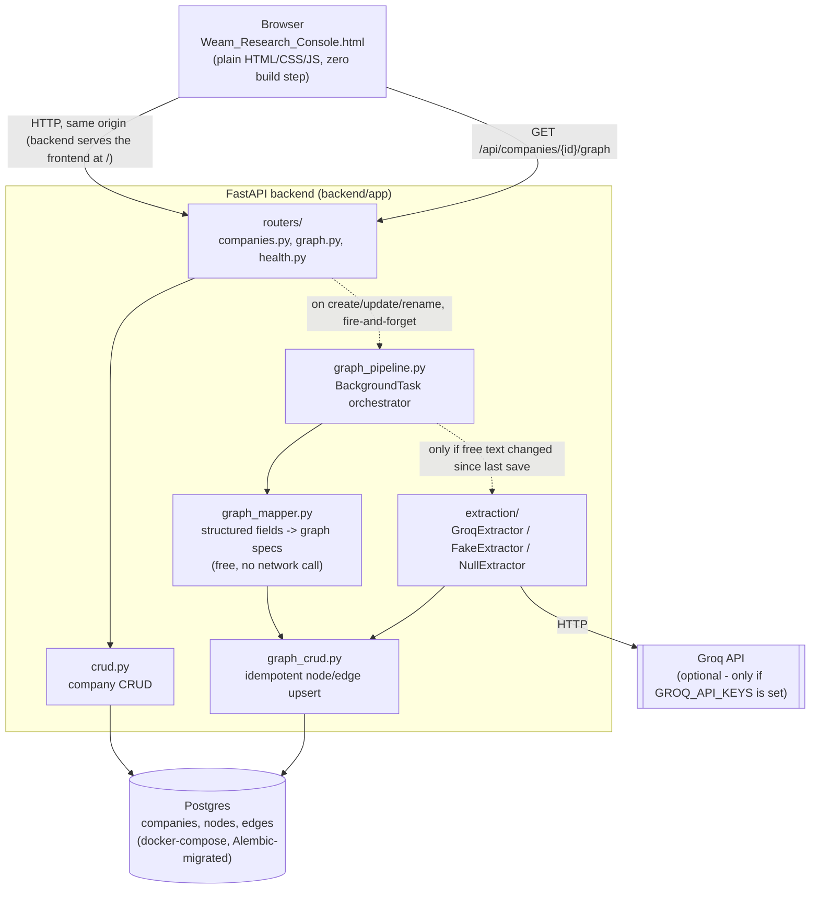

# Weam Research Console

A structured account-research tool for Home Services franchisors (ICP scoring, per-department
checklists, Fact/Assumption/Hypothesis findings, decision-matrix, sales-brief export). This
version replaces the old browser-`localStorage`-only persistence — which could be wiped by
browser data-clearing settings, disk cleanup, or a long shutdown — with a real backend
(FastAPI) and database (Postgres), a "Show history" panel over every company on record even
half-filled ones, and a knowledge graph per company that grows automatically from both
structured fields and free-text research notes as you work. Full technical detail in
`ARCHITECTURE.md`; the (not yet built) plan for feeding that graph into another LLM is in
`PHASE_3_PLAN.md`.

```
frontend/   the console itself — plain HTML/CSS/JS, one file, no build step
backend/    FastAPI + Postgres API that the frontend talks to
logs/       created automatically at runtime (gitignored)
```

## Architecture

This is what actually exists and runs today (Phases 0–2) — no planned/future pieces in this
diagram, those are called out separately below.



What the arrows mean, in plain terms:

- The browser talks to FastAPI over plain HTTP on the same origin — no separate frontend
  server, no CORS.
- Every company create/update/rename kicks off graph extraction as a `BackgroundTask`: the
  save itself returns immediately, extraction happens right after on its own DB session.
- The structured-field mapper (category, country, decision-maker, ticked checks) always runs —
  zero cost, zero network.
- The text extractor (pulls entities out of notes/findings) only runs when the free text
  actually changed since the last save (a stored sha256 hash) — so it doesn't burn a Groq call
  on every checkbox toggle, and it's entirely optional: with no `GROQ_API_KEYS` configured, the
  app runs on `NullExtractor` and the graph still populates fully from structured fields.
- Everything lands in the same Postgres database — no separate graph database, `nodes`/`edges`
  are plain tables with uniqueness constraints that make re-running extraction merge into
  existing rows instead of duplicating.

Full detail (data model, entity resolution, failure isolation, logging) is in
`ARCHITECTURE.md`.

## Setting this up after cloning (do this on any new machine, e.g. an office PC)

### 1. Prerequisites

- **Python 3.10+** (3.11 or 3.12 recommended; nothing here is 3.13-specific)
- **Docker Desktop** — for Postgres. A normal install includes the Compose plugin
  (`docker compose`); the steps below try that first and give a fallback if it's missing.
- **Git**

### 2. Clone and enter the backend folder

```
git clone <this-repo-url>
cd weam-research-platform/backend
```

### 3. Python environment

```
python -m venv venv
```
```
venv\Scripts\pip install -r requirements.txt      # Windows
venv/bin/pip install -r requirements.txt          # macOS/Linux
```

### 4. Configure environment variables

```
copy .env.example .env       # Windows
cp .env.example .env         # macOS/Linux
```
The defaults work as-is for a single-user local setup. If this machine is shared or reachable
by anyone other than you, change `POSTGRES_PASSWORD` in `.env` from the checked-in dev
placeholder to something real — `.env` itself is gitignored, so your real password never gets
committed.

**Optional — Groq API keys for real graph extraction.** The app works completely fine with
this left blank (the graph still gets populated from structured fields at zero cost); this only
enables pulling entities/relationships out of free-text research notes. If you have Groq keys,
add them to `.env`:
```
GROQ_API_KEYS=key1,key2,key3
```
Comma-separated, works with however many you have — they're tried in order and rotated past on
a rate limit. Not needed to run the automated test suite; every test uses a deterministic fake
extractor instead of calling the real API.

### 5. Start Postgres

Try Compose first:
```
docker compose up -d
```
If your Docker install doesn't have the Compose plugin (`docker compose` errors with
"unknown command"), use the equivalent plain `docker run` — same image, same named volume,
same healthcheck, just spelled out manually:
```
docker volume create weam_pgdata
docker run -d --name weam-research-db --restart unless-stopped ^
  -e POSTGRES_USER=weam -e POSTGRES_PASSWORD=weam_dev_local_only -e POSTGRES_DB=weam_research ^
  -p 5433:5432 -v weam_pgdata:/var/lib/postgresql/data ^
  --health-cmd="pg_isready -U weam -d weam_research" --health-interval=5s --health-retries=10 ^
  postgres:16
```
(`^` is Windows cmd's line-continuation; use `\` instead on macOS/Linux/PowerShell, or just put
it all on one line.) **If you changed the password in `.env`, use that same value here too** —
the app and the container need to agree on it.

Either way, confirm it's actually healthy before continuing:
```
docker ps --filter name=weam-research-db --format "{{.Names}}: {{.Status}}"
```
should show `(healthy)`, not `(starting)` or `(unhealthy)`.

### 6. Create the database schema

```
venv\Scripts\alembic upgrade head      # Windows
venv/bin/alembic upgrade head          # macOS/Linux
```

### 7. Run it

```
venv\Scripts\python -m uvicorn app.main:app --host 127.0.0.1 --port 8000      # Windows
venv/bin/python -m uvicorn app.main:app --host 127.0.0.1 --port 8000          # macOS/Linux
```
Open **http://localhost:8000/** — the backend serves the frontend directly (same origin, so
there's no CORS/`file://` weirdness). No separate frontend server or build step needed; nothing
in `frontend/` requires npm/node.

### 8. Verify nothing was skipped

```
venv\Scripts\python -m pytest -v
```
All tests should pass (66 at time of writing), including `test_restart_durability.py` (stops
and restarts the real Postgres container mid-test and proves the data survives — the literal
regression test for the original bug) and `test_phase2_acceptance.py` (grows a company's graph
across multiple saves and proves nothing duplicates). The durability test needs Docker running
and port 8010 free — if it fails with "port 8010 is already in use," a previous interrupted
test run left something listening there; the error message includes the exact command to clear
it. None of the 66 tests call the real Groq API, so this all passes with `GROQ_API_KEYS` blank.

If all of that passes, every feature from all three phases is present: durable storage, the
history panel, the knowledge graph, structured logging, and the full API surface — nothing was
skipped in cloning.

**One more manual check, only if you added real Groq keys**: open the app, add a company with
a free-text note mentioning a real name or tool, then call
`http://localhost:8000/api/companies/{id}/graph` (or use a REST client) and confirm real
entities appear — not just what the automated tests' fake extractor would produce.

## Day-to-day use after first setup

Only steps 5, 7 (start Postgres, start uvicorn) are needed on subsequent runs — the venv,
`.env`, and schema only need to be created once. `docker start weam-research-db` restarts an
already-created container without needing `docker run` again.

## Roadmap: ask questions against the knowledge graph (planned, not built)

The knowledge graph in Phase 2 only grows — every save adds facts, assumptions, hypotheses,
people, tools, competitors, without losing anything. The next planned piece turns that into a
per-company **queryable research wiki**: instead of scrolling the whole record, ask it directly —
"what gaps are still open here?", "which departments haven't been touched?", "what's the
strongest thing to target?" — and get an answer grounded in what's actually been entered, not a
generic guess.

This is an LLM feature, specifically: the LLM is used at *answer time*, not to hold the whole
graph in its head. Dumping an entire company's graph into a prompt doesn't scale as research
accumulates — most of it is irrelevant to any one question and token cost grows unbounded. The
planned design (full detail in `PHASE_3_PLAN.md`):

1. Embed every node/edge's text at write time (`pgvector`, same Postgres database — no separate
   vector store).
2. At query time, embed the question, vector-search that company's nodes/edges, expand 1–2 hops
   over the existing `edges` table.
3. Serialize only that bounded subgraph as compact triples into the prompt — cost stays flat no
   matter how large the full graph has grown.
4. Answer generation reuses the same Groq client/key-rotation already built for extraction — this
   is a retrieval layer on top of what exists, not a new LLM integration.
5. Surfaces as `POST /api/companies/{id}/ask`: question in, grounded answer out.

Not started — Phase 2 (storage + extraction) had to be solid first. `PHASE_3_PLAN.md` exists so
this has a concrete starting point instead of a blank page when it's picked up.

## More detail

See `backend/README.md` for the durability-test internals and the design decisions behind
the surrogate-id scheme and the client-side completion percentage.
